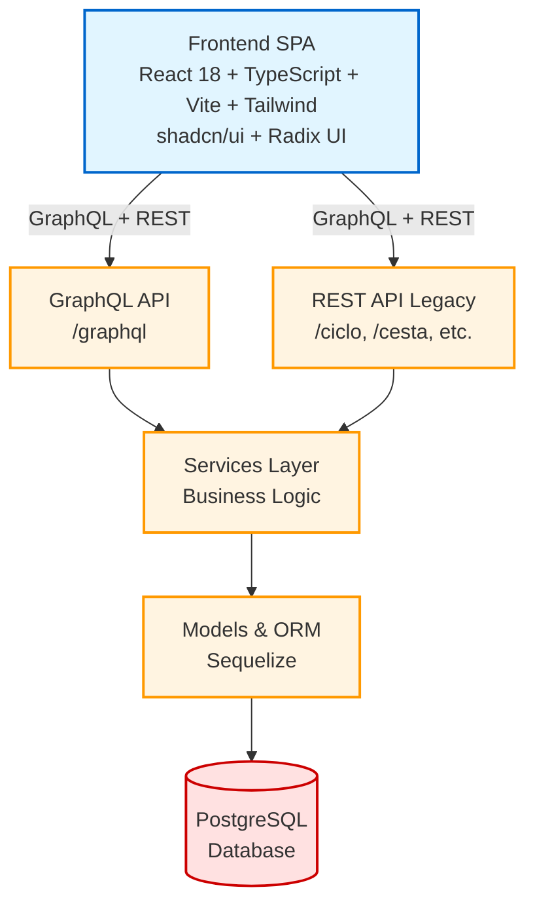

# Plataforma do Divino Alimento - versão Mercados

A plataforma do Divino Alimento facilita o fluxo de informação de vendas alimentos produzido por diversos agricultores e agricultoras, para diversos compradores e compradoras, por meio do ciclos de entrega de alimentos.

Atualizado em 2025 para atender três tipos de mercados:

1. Venda de cestas
2. Venda em lote como acontece por exemplo no Programa Nacional da Alimentação Escolar
3. Venda direta

Uma plataforma criada em 2021 a luz iniciativa do Divino Alimento, que é contada com mais detalhes no site da [Akarui](https://www.akarui.org.br/divinoalimento) que acontece em São Luiz do Paraitinga, SP, em diálogo entre consumidores e agricultores e agricultoras ligados à Associação Minhoca.

Sua [primeira versão](https://github.com/AssociacaoAkarui/divinoalimento_cestas) foi desenvolvida por Carmen Freitas (Desenvolvedora) em diálogo com Juliana Farinaci (Comunicação da Akarui). 

Em 2025, se somam mais pessoas ao processo que culmina na versão 2 cujo código está nesse repositório. 

São Alejandro González (Lider Técnico), Nádia Coelho Pontes (Desenvolvedora), Ana Laura Carrilli (Extensionista), Damaris Chaves (Administrativo da Akarui), Daniela Coura (Extensionista), Allan Carlos (Design de Interface), Leonardo Ávila (Pesquisador em Design) e Sofia Kraja (Financeiro da Akarui).

---

# Arquitetura do Sistema

Arquitetura técnica da plataforma Divino Alimento - Versão Mercados.

## Visão Geral

A plataforma Divino Alimento é uma aplicação web full-stack que facilita a distribuição de produtos em múltiplos mercados. O sistema utiliza uma **arquitetura híbrida** que combina:

- Backend legado com renderização server-side (Express + EJS)
- Frontend como SPA (React + TypeScript)
- APIs REST (legado) e GraphQL



## Stack Tecnológico

### Backend

#### Core
- **Runtime**: Node.js
- **Framework**: Express.js ^4.21.2
- **Template Engine**: EJS ^3.1.6 (views legadas)
- **ORM**: Sequelize ^6.37.1
- **Database**: PostgreSQL (produção), SQLite (testes)

#### APIs
- **GraphQL**: graphql ^16.11.0
- **GraphQL HTTP**: graphql-http ^1.22.4
- **GraphQL IDE**: Ruru ^2.0.0-beta.30

#### Autenticação
- **OAuth2/OIDC**: express-openid-connect ^2.4.0
- **Session Management**: Model Session com tokens

#### Utilitários
- **PDF Generation**: PDFKit ^0.12.1
- **CSV Export**: json2csv ^5.0.7
- **Environment Config**: dotenv ^9.0.1

#### Desenvolvimento
- **Auto-reload**: Nodemon ^2.0.7
- **Migrations**: Sequelize CLI ^6.6.2

### Frontend

#### Build & Tooling
- **Build Tool**: Vite ^5.4.19
- **Language**: TypeScript ^5.8.3
- **Linting**: ESLint ^9.32.0
- **Package Manager**: Bun (lockfile presente)

#### Framework & Bibliotecas
- **UI Framework**: React ^18.3.1
- **React DOM**: ^18.3.1
- **Routing**: React Router DOM ^6.30.1

#### UI Components
- **Component Library**: shadcn/ui (headless)
- **Primitives**: Radix UI (30+ componentes)
  - Accordion, Alert Dialog, Avatar, Checkbox
  - Dialog, Dropdown Menu, Select, Tabs
  - Toast, Tooltip, e muitos outros
- **Icons**: Lucide React ^0.462.0

#### Styling
- **CSS Framework**: Tailwind CSS ^3.4.17
- **Typography**: @tailwindcss/typography
- **Utilities**: 
  - clsx ^2.1.1
  - tailwind-merge ^2.6.0
  - class-variance-authority ^0.7.1
  - tailwindcss-animate ^1.0.7

#### State Management
- **Server State**: TanStack React Query ^5.83.0
- **Client State**: React Context API
- **GraphQL Client**: graphql-request ^7.3.1

#### Forms & Validation
- **Forms**: React Hook Form ^7.62.0
- **Resolvers**: @hookform/resolvers ^3.10.0
- **Validation**: Zod ^3.25.76

#### Componentes Especializados
- **Date Picker**: React Day Picker ^8.10.1
- **Date Utils**: date-fns ^3.6.0
- **Charts**: Recharts ^2.15.4
- **Carousel**: Embla Carousel React ^8.6.0
- **Notifications**: Sonner ^1.7.4
- **Themes**: Next Themes ^0.3.0
- **Drawer**: Vaul ^0.9.9
- **OTP Input**: input-otp ^1.4.2
- **Panels**: react-resizable-panels ^2.1.9

### Testing

#### Frameworks
- **BDD**: Cucumber ^12.2.0
- **Unit**: Jest (configurado)
- **E2E**: Mocha ^11.7.4
- **Assertions**: Chai ^4.3.6
- **Test Data**: @faker-js/faker ^10.0.0

### DevOps

- **Containerização**: Docker & Docker Compose v2
- **Automação**: Rake (Ruby-based)
- **Mock Auth**: Mock OAuth2 Server (desenvolvimento)

## Estrutura do Projeto

```
DivinoAlimento/
├── app/                          # Backend Node.js
│   ├── src/
│   │   ├── server.js            # Servidor Express
│   │   ├── routes.js            # Definição de rotas
│   │   ├── api-graphql.js       # Resolvers GraphQL
│   │   ├── api.graphql          # Schema GraphQL
│   │   │
│   │   ├── controllers/         # Controllers REST
│   │   │   ├── CicloController.js
│   │   │   ├── CestaController.js
│   │   │   ├── ProdutoController.js
│   │   │   ├── OfertaController.js
│   │   │   ├── ComposicaoController.js
│   │   │   ├── PedidoConsumidoresController.js
│   │   │   ├── UsuarioController.js
│   │   │   ├── RelatoriosController.js
│   │   │   └── ...
│   │   │
│   │   ├── model/               # Business Logic
│   │   │   ├── Ciclo.js
│   │   │   ├── Produto.js
│   │   │   ├── Usuario.js
│   │   │   └── ...
│   │   │
│   │   ├── services/            # Service Layer
│   │   │   ├── services.js
│   │   │   └── ...
│   │   │
│   │   ├── db/                  # SQL Queries
│   │   │   ├── cicloSql.js
│   │   │   ├── produtoSql.js
│   │   │   └── ...
│   │   │
│   │   └── views/               # Templates EJS (legado)
│   │       ├── index.ejs
│   │       ├── ciclo.ejs
│   │       └── parts/
│   │
│   ├── models/                  # Sequelize Models
│   │   ├── index.js
│   │   ├── usuario.js
│   │   ├── ciclo.js
│   │   ├── produto.js
│   │   ├── oferta.js
│   │   ├── cesta.js
│   │   ├── session.js           # Sessões GraphQL
│   │   └── ...
│   │
│   ├── migrations/              # Database Migrations
│   │   ├── 20210513-create-produto.js
│   │   ├── 20250923-create-sessions.js
│   │   └── ...
│   │
│   ├── features/                # BDD Tests (Cucumber)
│   │   ├── ciclo.feature
│   │   ├── usuario.feature
│   │   ├── sessions.feature
│   │   └── step_definitions/
│   │
│   ├── config/                  # Configurações
│   │   └── config.js
│   │
│   ├── public/                  # Assets estáticos
│   │
│   ├── package.json
│   ├── cucumber.js
│   └── jest.config.js
│
├── frontend/                    # Frontend React
│   ├── src/
│   │   ├── main.tsx            # Entry point
│   │   ├── App.tsx             # Routing principal
│   │   │
│   │   ├── pages/              # Páginas
│   │   │   ├── Index.tsx       # Homepage
│   │   │   ├── Login.tsx
│   │   │   ├── Register.tsx
│   │   │   ├── Dashboard.tsx
│   │   │   ├── Cesta.tsx
│   │   │   ├── Resumo.tsx
│   │   │   │
│   │   │   ├── admin/          # Área administrativa
│   │   │   │   ├── AdminDashboard.tsx
│   │   │   │   ├── AdminMercados.tsx
│   │   │   │   ├── AdminProdutos.tsx
│   │   │   │   ├── AdminEstoque.tsx
│   │   │   │   └── ...
│   │   │   │
│   │   │   └── fornecedor/     # Área do fornecedor
│   │   │       ├── FornecedorLogin.tsx
│   │   │       ├── LojaProdutor.tsx
│   │   │       ├── PedidosAberto.tsx
│   │   │       └── ...
│   │   │
│   │   ├── components/         # Componentes
│   │   │   ├── ui/            # shadcn/ui components
│   │   │   │   ├── button.tsx
│   │   │   │   ├── card.tsx
│   │   │   │   ├── dialog.tsx
│   │   │   │   └── ... (50+)
│   │   │   │
│   │   │   └── layout/        # Layout components
│   │   │       ├── AppShell.tsx
│   │   │       ├── ResponsiveLayout.tsx
│   │   │       ├── AdminSidebar.tsx
│   │   │       └── ...
│   │   │
│   │   ├── hooks/             # Custom Hooks
│   │   │   ├── graphql.ts     # GraphQL queries/mutations
│   │   │   ├── useCycle.tsx
│   │   │   └── use-mobile.tsx
│   │   │
│   │   ├── contexts/          # React Context
│   │   │   └── ConsumerContext.tsx
│   │   │
│   │   ├── assets/            # Imagens, ícones
│   │   │
│   │   └── lib/               # Utilitários
│   │
│   ├── public/                # Static assets
│   ├── index.html
│   ├── vite.config.ts
│   ├── tailwind.config.ts
│   ├── tsconfig.json
│   └── package.json
│
├── mock-oauth2-server/        # OAuth Mock (dev)
├── compose.live.yml           # Docker Compose
├── compose.tests.yml          # Docker Compose Tests
├── Rakefile                   # Rake tasks
├── env.example                # Environment template
└── README.md
```
---

## Passo a passo para instalar a plataforma em seu computador

Clonar o repositório em um lugar do computador de seu conhecimento. 

No terminal, utilizar o código abaixo:

`git clone https://github.com/AssociacaoAkarui/DivinoAlimento.git`

*obs:*  a versão mais atualizada está na [rama](https://github.com/AssociacaoAkarui/DivinoAlimento/tree/feature/graphql-client-cors)

3. Na pasta que foi criada, utilizando o comando cd 

`cd DivinoAlimento`

Copiar o arquivo com nome "env.example" para a pasta oculta com nome .env. Nesse documento "env.example" tem as configuração das portas e dos acessos incluíndo login e senha.

`cp env.example .env`

Nesse arquivo, a porta padrão é 13000 e pode ser alterada na [linha](https://github.com/AssociacaoAkarui/DivinoAlimento/blob/main/env.example#L7) 

Vamos ao *rake*, para poder ligar ou desligar o docker que contém o programa do Divino Alimento. Para conhecer os comandos, utilize:

`rake --tasks`

Para construir:

`rake vivo:constroi`

Para subir o docker

`rake vivo:liga`

*Obs: nesse momento precisa colocar o usuário que foi criado, como usuário administrativo para que possa ter acesso a todo o programa. 

Assim precisamos popular o banco de dados. Para tanto:

`rake vivo:popular`

*observação: na tela do sistema é possível acrescentar outras cestas ou editar as informações destas duas. Porém os relatórios não irão incluir as novas cestas cadastradas.*

Para acessar o programa usamos a porta 13000 (ou a porta que deixamos configurada no arquivo .env). Para tanto no buscador de internet colocar:

`localhost:13000`

Para parar o docker

`rake vivo:para`

## Dependências ou programas necessários em seu computador para utilizar o programa:

1. **docker-compose-v2**
2. **rake**
3. **git**
